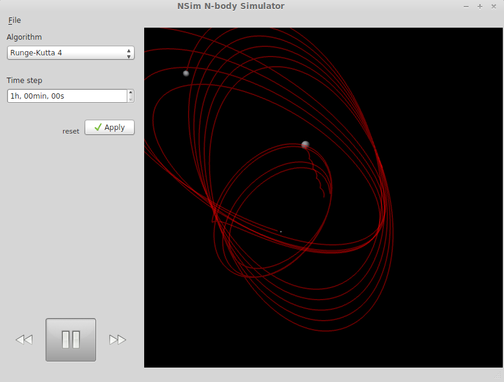

# Nsim (N-body Simulator)

NSim is a simulator of the Solar system, or in general any system of objects
with gravitational forces between them. It can visualize the results in a 3D
animation, or provide the raw data on the command line. Instead of using
pre-computed data like Stelarium or Celestia do, it does the computation
itself and thus it's possible to create arbitrary systems of celestial bodies.

The simulator predicts the motions of objects using numerical integration,
since there is no analytic solution to a system with more than two bodies.
Gravitational interactions are computed with classical Newtonian mechanics and
the bodies are modelled as simple point masses (their volume and shape are not
taken into consideration).

## Installation

You will need:

* a compiler that supports C++11 (g++ is recommended)

        $ apt-get install g++

* at least [Qt 5.4](http://www.qt.io/download-open-source/)
* OpenGL 3.1 (lower versions might work, but are untested)

Afterwards, run:

    $ qmake
    $ make

Execute:

    $ bin/nsim  # GUI
    $ bin/nsim-cmd -h

## Graphical Interface

Warning: The GUI is in an alpha stage of development, some of the elements
might not be implemented yet.
    
Load a project (a file containing the positions of objects) from the `example/`
directory and hit the play button to start the animation.

Depending on the algorithm, number of the objects in the simulation and your
hardware, the animation might be very slow.
